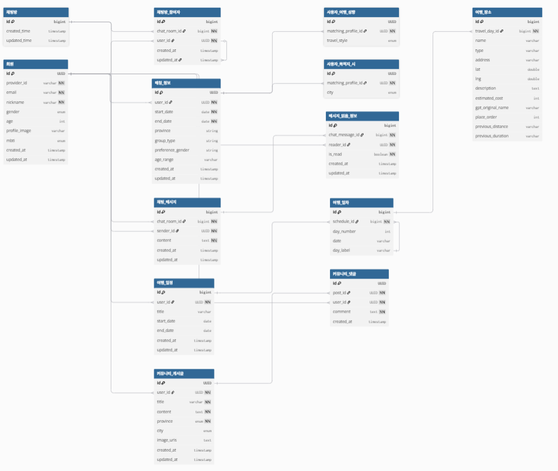

 
 

# 1. Project Overview (프로젝트 개요)
📌 프로젝트 이름: 모여  
📌 프로젝트 설명: 본 프로젝트는 **새로운 사람과의 색다른 여행 경험** 을 추구하는 여행자들을 위한 종합 여행 편의 서비스입니다.

단순한 정보 제공을 넘어, 사용자의 여행 성향과 요구를 정밀하게 분석하여 꼭 맞는 여행 동행자를 매칭합니다.   
또한, 방대한 여행지 정보의 효율적인 탐색과 최적화된 여행 경로 추천 기능을 통해, 사용자가 계획의 부담에서 벗어나 여행 자체의 즐거움에만 집중할 수 있도록 돕습니다.

# 2. Team Members (팀원 및 팀 소개)
|                                     박래환                                     |                                        정세현                                         |                             백민기                              |                             최광원                              |                             김민수                              |
|:---------------------------------------------------------------------------:|:----------------------------------------------------------------------------------:|:------------------------------------------------------------:|:------------------------------------------------------------:|:------------------------------------------------------------:|
|                                     BE                                      |                                         FE                                         |                              BE                              |                              PM                              |                              FE                              |
|                 |                        |  |  |  |
|                  [GitHub](https://github.com/ParkRaeHwan)                   |                        [GitHub](https://github.com/nyago17)                        |            [GitHub](https://github.com/ignim001)             |            [GitHub](https://github.com/gone0910)             |             [GitHub](https://github.com/damchun)             |
| - Back-End 총괄 - OAuth 기반 로그인 및 회원가입 구현, 사용자, 채팅(WebSocket), 커뮤니티, 매칭 도메인 구현 | - Front-End 총괄 - 로그인, 여행자 매칭, AI 여행 플랜, 채팅(WebSocket), 커뮤니티 등 주요 기능 전반의 화면 및 로직 구현 |                                                              |                                                              |                                                              |
 

# 3. Key Features (주요 기능)
- **회원가입 및 로그인**:
  - Oauth2.0 기반 Kakao, Google 로그인

- **여행자 매칭**:
  - 서비스를 이용하는 여행자들간 매칭 기능

- **채팅 시스템**:
  - 매칭된 여행자들간 채팅 기능

- **AI 여행 플랜 제공**:
  - AI Gemini 기반 여행 플랜 생성 기능

- **내 여행 관리**:
  - AI 여행 플랜 기반 생성된 플랜 관리 기능

- **챗봇 기능**:
  - AI Gemini 기반 여행지 관련 챗봇 기능

- **커뮤니티**:
  - 여행자들간 커뮤니티 기능
 

# 4. 아키텍처 (기술 스택 및 ERD)

## 기술 스택

 

## 기술 스택 설명
| 툴         | 설명             |
|-----------|----------------|
| OAuth2.0  | OAuth2.0 기반 카카오, 구글 로그인 기능 |
| Gemini API | Gemini API를 이용한 여행 플랜 생성 기능 |
| 카카오 맵 API | 여행 플랜 생성시 존재 여부 검증, 상세 위치 화면 출력 |
| OpenWeather API, Tour API | 챗봇 기능 응답 데이터 활용|
| Google Docs | 프로젝트 개요, 회의록 작성, 보관용 |

## ERD

 

# 5. 

# 6. 

# 7. 

